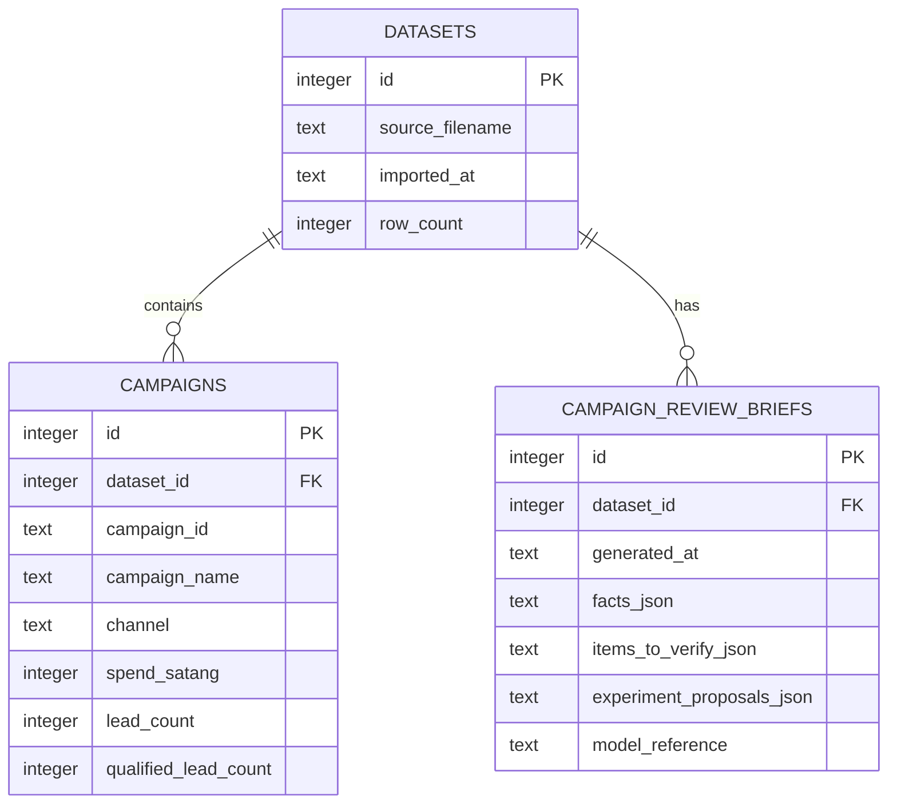

# Entity Relationship Diagram

# Table Definitions

- `datasets`
  - `id INTEGER PRIMARY KEY`
  - `source_filename TEXT NOT NULL`
  - `imported_at TEXT NOT NULL` ISO-8601 UTC
  - `row_count INTEGER NOT NULL CHECK(row_count >= 0)`
- `campaigns`
  - `id INTEGER PRIMARY KEY`
  - `dataset_id INTEGER NOT NULL REFERENCES datasets(id) ON DELETE CASCADE`
  - `campaign_id TEXT NOT NULL`
  - `campaign_name TEXT NOT NULL`
  - `channel TEXT NOT NULL`
  - `spend_satang INTEGER NOT NULL CHECK(spend_satang >= 0)`; convert from input `spend_thb` using exact decimal parsing
  - `lead_count INTEGER NOT NULL CHECK(lead_count >= 0)`
  - `qualified_lead_count INTEGER NOT NULL CHECK(qualified_lead_count >= 0 AND qualified_lead_count <= lead_count)`
  - unique index `(dataset_id, campaign_id)`
  - index `(dataset_id, channel)`
- `campaign_review_briefs`
  - `id INTEGER PRIMARY KEY`
  - `dataset_id INTEGER NOT NULL REFERENCES datasets(id) ON DELETE CASCADE`
  - `generated_at TEXT NOT NULL` ISO-8601 UTC
  - `facts_json TEXT NOT NULL`
  - `items_to_verify_json TEXT NOT NULL`
  - `experiment_proposals_json TEXT NOT NULL`
  - `model_reference TEXT NULL`

# Data Classification

`pdpa_classification` enum values fixed by template: `Personal`, `Sensitive`, `Non-personal`.

`confidentiality_class` enum values for this project: `internal`, `secret`.

| Data | pdpa_classification | confidentiality_class | Notes |
|---|---|---|---|
| Campaign performance fields | Non-personal | internal | Business performance data; no direct person field in current CSV |
| Dataset source filename | Non-personal | internal | Do not expose filesystem path |
| Derived metrics | Non-personal | internal | Computed from campaign data |
| AI brief content | Non-personal | internal | May reveal business performance; keep internal |
| AI API key | Non-personal | secret | Secret is not stored in product tables; loaded from deployment secret store |

# Data Retention Policy

- `datasets` and related `campaigns`: retention period = `null` — calibration owner: Growth Marketing Data Owner
- `campaign_review_briefs`: retention period = `null` — calibration owner: Growth Marketing Data Owner
- Product data deletion is hard delete by dataset with cascading child rows for MVP; no soft delete
- Audit-log retention is not declared here; SECURITY.md owns audit-log policy and period
- If future schema adds personal data, erasure flow must be redesigned before implementation

# Migration Strategy

- Use versioned SQLAlchemy/Alembic migrations once schema changes beyond initial creation
- Initial MVP may bootstrap an empty database from migration `001_initial`
- Migration commands must run before application startup health is considered ready
- Irreversible data transformation must be handled with roll-forward strategy documented in DEPLOYMENT.md
